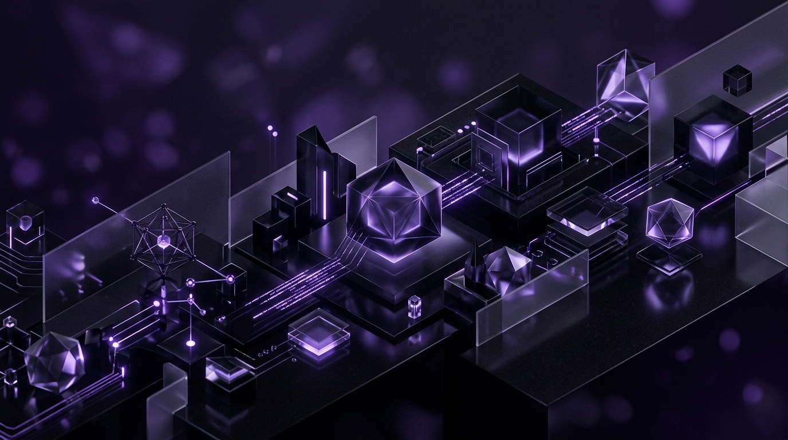

  

 

  <h1 align="center">MUHAMMAD HASEEB HASSAN</h1>
  

    <strong>FULL-STACK AI ENGINEER &nbsp; • &nbsp; SYSTEMS ARCHITECT &nbsp; • &nbsp; CREATIVE DEVELOPER</strong>
  

  

    Architecting scalable web applications, robust machine learning pipelines, and highly optimized cloud-native platforms. Specialized in Next.js 16, FastAPI, and RAG architectures.
  

   
  
  &nbsp;&nbsp;
  &nbsp;&nbsp;
  

  

### 01 / FEATURED ARCHITECTURE

<table width="100%" style="border-collapse: collapse; border: none;">
  <tr>
    <td width="50%" valign="top" style="border: 1px solid #222; padding: 20px;">
      <h3 align="left">VENTUREFIT V2.0</h3>
      
<em>AI-Powered Startup Validation Engine</em>

      

        Engineered a 9-module RAG pipeline utilizing sentence-transformers for semantic retrieval over a 3M-record FAISS index. Built an unsupervised ML analytics engine (HDBSCAN clustering) to analyze live data from Reddit, HN, and GitHub.
      

       
      <code>FastAPI</code> <code>Next.js</code> <code>PostgreSQL</code> <code>FAISS</code> <code>BERTopic</code>
    </td>
    <td width="50%" valign="top" style="border: 1px solid #222; padding: 20px;">
      <h3 align="left">SMARTSPEND</h3>
      
<em>Autonomous Wealth Management Platform</em>

      

        A production-grade FinTech SaaS featuring an AI-powered expense categorizer via OpenRouter and robust anomaly detection. Includes full Stripe integration and secure Vercel Cron processing.
      

       
      <code>Next.js 16</code> <code>TypeScript</code> <code>MongoDB</code> <code>Stripe</code> <code>OpenRouter</code>
    </td>
  </tr>
  <tr>
    <td width="50%" valign="top" style="border: 1px solid #222; padding: 20px;">
      <h3 align="left">TEKRON</h3>
      
<em>Cloud-Native MERN E-Commerce</em>

      

        Orchestrated a highly scalable containerized Kubernetes deployment on AWS EC2 via Minikube. Integrated Redis caching, Socket.IO real-time events, and Jenkins CI/CD pipeline with Selenium automation.
      

       
      <code>Next.js 14</code> <code>Redis</code> <code>Docker</code> <code>Kubernetes</code> <code>AWS EC2</code>
    </td>
    <td width="50%" valign="top" style="border: 1px solid #222; padding: 20px;">
      <h3 align="left">ENTERPRISE COMMAND CENTER</h3>
      
<em>C-Suite Financial Dashboard</em>

      

        A highly secure bespoke financial dashboard engineered for C-level executives. Architected with rigorous security protocols including mandatory email-based 2FA (OTP) and short-lived JWT sessions.
      

       
      <code>Express.js</code> <code>React</code> <code>Node.js</code> <code>JWT</code> <code>Bcrypt</code>
    </td>
  </tr>
</table>

  

### 02 / TECHNICAL ARSENAL

  
    
  
    
  
    
  
  
    

  

    <strong>— MACHINE LEARNING & NLP —</strong>
  

  
  
  
  
  

  

### 03 / OPERATING PRINCIPLES

<table width="100%" style="border-collapse: collapse; border: none;">
  <tr>
    <td width="25%" align="center" style="border: 1px solid #222; padding: 20px;">
      <h4>SHIP SMART</h4>
      
Done &gt; perfect. Refactor with context.

    </td>
    <td width="25%" align="center" style="border: 1px solid #222; padding: 20px;">
      <h4>AI = AMPLIFIER</h4>
      
I direct it. I don't follow it.

    </td>
    <td width="25%" align="center" style="border: 1px solid #222; padding: 20px;">
      <h4>DOCS FIRST</h4>
      
Undocumented code is future tech debt.

    </td>
    <td width="25%" align="center" style="border: 1px solid #222; padding: 20px;">
      <h4>SYSTEMS WIN</h4>
      
Build the engine, not just the dashboard.

    </td>
  </tr>
</table>

  

  
<strong>CURRENT STATUS:</strong> Open to Opportunities & Collaborations

